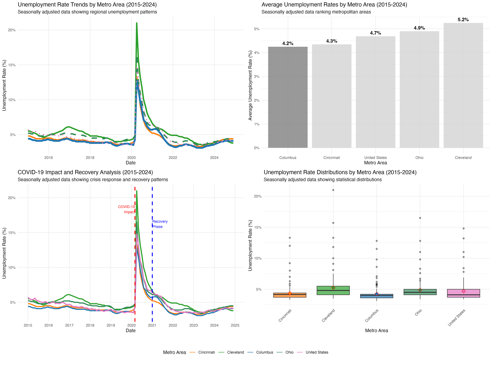

# BLS Unemployment Analysis: Columbus vs. Ohio Metros

An analysis of unemployment trends in Columbus, Ohio compared to other major Ohio metropolitan areas and the United States using seasonally adjusted data from Bureau of Labor Statistics (BLS) and FRED (Federal Reserve Economic Data).

## Analysis Overview

This project analyzes unemployment data from 2015-2024 for:
- **Columbus, OH** (COLU139UR)
- **Cincinnati, OH** (CINC139UR) 
- **Cleveland, OH** (CLEV439UR)
- **Ohio State** (OHUR)
- **United States** (National Average)

## Key Findings

- **Columbus** recorded the lowest average unemployment rate (4.24%) among all analyzed metros
- **Columbus** unemployment averaged 0.65 percentage points below Ohio state and 0.44 percentage points below the US average
- **Consistent patterns** observed across all metros throughout the 2015-2024 period
- **COVID-19 impact** affected all metros similarly, with varying recovery trajectories

## Results Story

### Dashboard



This dashboard synthesizes all key findings, providing a complete view of unemployment patterns across metropolitan areas and their relationship to regional and national benchmarks.

## 📁 Repository Structure

```
BLS/
├── README.md                           
├── .gitignore                         
├── data/                               
│   ├── COLU139UR.csv                   
│   ├── CINC139UR.csv                 
│   ├── CLEV439UR.csv                   
│   ├── OHUR.csv                      
│   ├── seasonally_adjusted_unemployment.csv  # Combined clean dataset
│   └── sa_summary_statistics.csv       
├── visualizations/                     # All generated charts and graphs
│   ├── sa_main_trends.jpg              
│   ├── sa_columbus_focus.jpg           
│   ├── sa_ranking.jpg                
│   ├── sa_covid_analysis.jpg          
│   ├── sa_columbus_ohio_us.jpg        
│   ├── sa_boxplot.jpg                
│   └── sa_dashboard.jpg              
└── code/                               
    └── bls_unemployment_analysis.R     
```

## Quick Start

1. **Clone the repository**
   ```bash
   git clone https://github.com/samyakshr/bls-unemployment-analysis.git
   cd bls-unemployment-analysis
   ```

2. **Install R dependencies**
   ```r
   install.packages(c("readr", "dplyr", "ggplot2", "scales", "lubridate", "tidyr", "gridExtra", "cowplot"))
   ```

3. **Run the analysis**
   ```r
   source("code/bls_unemployment_analysis.R")
   ```

## Results Summary

| Metro | Average Rate | Rank |
|-------|-------------|------|
| Columbus | 4.24% | 1st |
| Cincinnati | 4.35% | 2nd |
| United States | 4.68% | 3rd |
| Ohio | 4.89% | 4th |
| Cleveland | 5.24% | 5th |

## Methodology

- **Data Source**: FRED (Federal Reserve Economic Data)
- **Seasonal Adjustment**: All data is seasonally adjusted for valid comparisons
- **Time Period**: January 2015 - December 2024

## Data Sources

Bureau of Labor Statistics. "Unemployment Rate for Columbus, OH (MSA)." *Federal Reserve Economic Data*, Federal Reserve Bank of St. Louis, 2024, fred.stlouisfed.org/series/COLU139UR.

Bureau of Labor Statistics. "Unemployment Rate for Cincinnati, OH (MSA)." *Federal Reserve Economic Data*, Federal Reserve Bank of St. Louis, 2024, fred.stlouisfed.org/series/CINC139UR.

Bureau of Labor Statistics. "Unemployment Rate for Cleveland, OH (MSA)." *Federal Reserve Economic Data*, Federal Reserve Bank of St. Louis, 2024, fred.stlouisfed.org/series/CLEV439UR.

Bureau of Labor Statistics. "Unemployment Rate for Ohio." *Federal Reserve Economic Data*, Federal Reserve Bank of St. Louis, 2024, fred.stlouisfed.org/series/OHUR.

Bureau of Labor Statistics. "Unemployment Rate." *Federal Reserve Economic Data*, Federal Reserve Bank of St. Louis, 2024, fred.stlouisfed.org/series/UNRATE.


